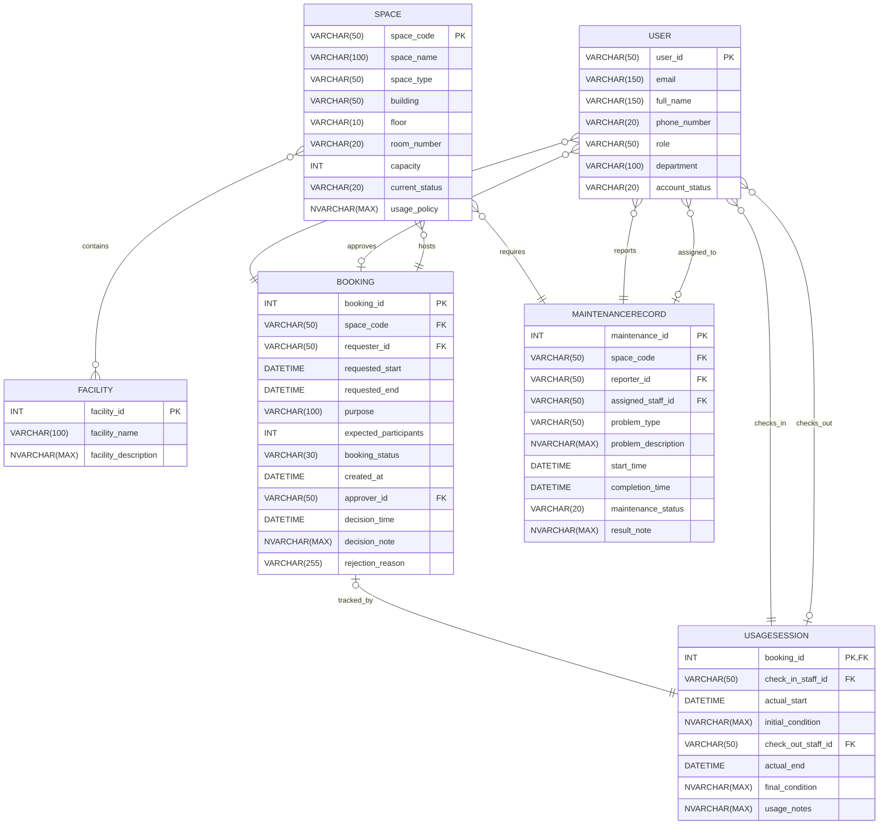

# Step 2: ERD Design — Campus Space Management System

---

## 1. Design Decisions

This ERD uses crow's foot notation rendered via Mermaid `erDiagram`. It is derived strictly from the provided Business Requirement Analysis (BRA) document. Multi-role relationships for the `User` entity (e.g., as requester, approver, check-in staff, maintenance reporter) are represented as distinct relationship lines to maintain clear, unambiguous structural definitions. Many-to-Many relationships, specifically `Space` to `Facility`, are handled as defined, though Mermaid `erDiagram` visualizes this as direct connectivity; complex association attributes are not currently present in the requirements for this relationship. All foreign keys and primary keys are explicitly mapped as defined in the BRA.

---

## 2. Entity-Relationship Diagram

---

## 3. Relationship Summary Table

| # | Relationship Name | Entity A | Cardinality | Entity B | Notes |
|---|---|---|---|---|---|
| 1 | User_Requests_Booking | User | (0,N) : (1,1) | Booking | Requester role |
| 2 | User_Approves_Booking | User | (0,N) : (0,1) | Booking | Approver role |
| 3 | Space_Hosts_Booking | Space | (0,N) : (1,1) | Booking | |
| 4 | Space_Equipped_With_Facility | Space | (0,M) : (0,N) | Facility | |
| 5 | Booking_Has_UsageSession | Booking | (0,1) : (1,1) | UsageSession | |
| 6 | User_ChecksIn_UsageSession | User | (0,N) : (1,1) | UsageSession | Check-in role |
| 7 | User_ChecksOut_UsageSession | User | (0,N) : (0,1) | UsageSession | Check-out role |
| 8 | Space_Requires_Maintenance | Space | (0,N) : (1,1) | MaintenanceRecord | |
| 9 | User_Reports_Maintenance | User | (0,N) : (1,1) | MaintenanceRecord | Reporter role |
| 10 | User_Assigned_To_Maintenance | User | (0,N) : (0,1) | MaintenanceRecord | Assigned staff role |

---

## 4. Attribute Traceability

### User Entity
| Attribute | BRA §4 Source |
|---|---|
| `user_id` | §4.1 |
| `email` | §4.1 |
| `full_name` | §4.1 |
| `phone_number` | §4.1 |
| `role` | §4.1 |
| `department` | §4.1 |
| `account_status` | §4.1 |

### Space Entity
| Attribute | BRA §4 Source |
|---|---|
| `space_code` | §4.2 |
| `space_name` | §4.2 |
| `space_type` | §4.2 |
| `building` | §4.2 |
| `floor` | §4.2 |
| `room_number` | §4.2 |
| `capacity` | §4.2 |
| `current_status` | §4.2 |
| `usage_policy` | §4.2 |

### Facility Entity
| Attribute | BRA §4 Source |
|---|---|
| `facility_id` | §4.3 |
| `facility_name` | §4.3 |
| `facility_description` | §4.3 |

### Booking Entity
| Attribute | BRA §4 Source |
|---|---|
| `booking_id` | §4.4 |
| `space_code` | §4.4 |
| `requester_id` | §4.4 |
| `requested_start` | §4.4 |
| `requested_end` | §4.4 |
| `purpose` | §4.4 |
| `expected_participants` | §4.4 |
| `booking_status` | §4.4 |
| `created_at` | §4.4 |
| `approver_id` | §4.4 |
| `decision_time` | §4.4 |
| `decision_note` | §4.4 |
| `rejection_reason` | §4.4 |

### UsageSession Entity
| Attribute | BRA §4 Source |
|---|---|
| `booking_id` | §4.5 |
| `check_in_staff_id` | §4.5 |
| `actual_start` | §4.5 |
| `initial_condition` | §4.5 |
| `check_out_staff_id` | §4.5 |
| `actual_end` | §4.5 |
| `final_condition` | §4.5 |
| `usage_notes` | §4.5 |

### MaintenanceRecord Entity
| Attribute | BRA §4 Source |
|---|---|
| `maintenance_id` | §4.6 |
| `space_code` | §4.6 |
| `reporter_id` | §4.6 |
| `assigned_staff_id` | §4.6 |
| `problem_type` | §4.6 |
| `problem_description` | §4.6 |
| `start_time` | §4.6 |
| `completion_time` | §4.6 |
| `maintenance_status` | §4.6 |
| `result_note` | §4.6 |
