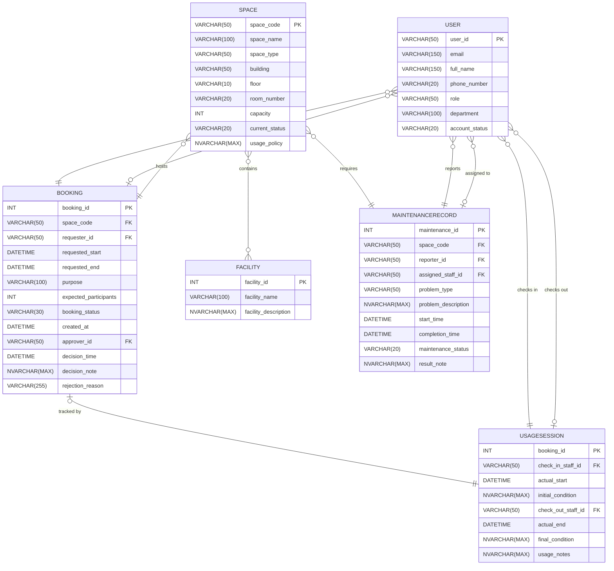

# 02-erd-design-G02.md (Corrected)

## 1. Design Decisions
This ERD maps the entities and relationships required for the Campus Space Management System. The design reflects a centralized system tracking users, space management, booking, usage tracking, and maintenance. To handle the M:N relationship between `Space` and `Facility` without introducing junction entities, we define a direct relationship as requested. All entities include primary keys as defined in the Business Requirement Analysis, with foreign key relationships enforcing referential integrity.

## 2. Entity-Relationship Diagram

