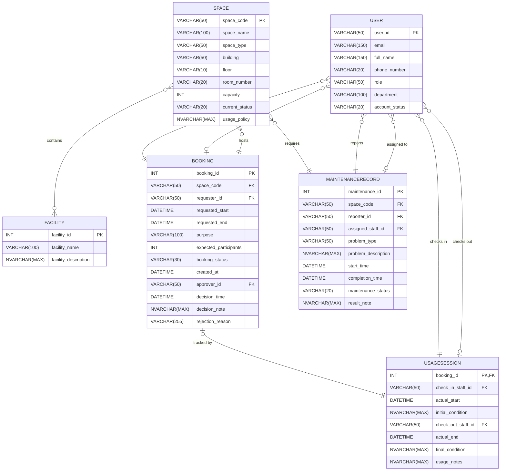

# Step 2: ERD Design — Campus Space Management System

---

## 1. Design Decisions

This Entity-Relationship Diagram (ERD) is modeled using **Crow's Foot notation** and rendered dynamically as Mermaid `erDiagram` code. Crow's foot notation is selected because of its industry-standard capability to clearly represent minimum and maximum participation constraints. 

To handle complex multi-role interactions where the `User` entity interacts with other entities under different roles, each role is represented as a distinct, individually labeled relationship line rather than collapsing them. This prevents ambiguity and preserves precise traceability back to the Business Requirement Analysis (BRA) document. 

The many-to-many (M:N) relationship between `Space` and `Facility` is shown directly at the conceptual level in this ERD using standard crow's foot multiplicity lines. The creation of an associative/junction table to resolve this M:N relationship is deferred to the Step 3 Logical Design phase, ensuring the conceptual ERD remains faithful to the business view of the requirements.

All entity names are represented in ALL_CAPS as single tokens to comply with Mermaid syntax. Attribute names and data types are mapped verbatim from the BRA §4, and all foreign keys (FK) are explicitly labeled.

---

## 2. Entity-Relationship Diagram

---

## 3. Relationship Summary Table

| # | Relationship Name | Entity A | Cardinality | Entity B | Notes |
|---|---|---|---|---|---|
| 1 | User_Requests_Booking | User | (0,N) : (1,1) | Booking | A User requests 0..N Bookings; a Booking is requested by exactly 1 User. |
| 2 | User_Approves_Booking | User | (0,N) : (0,1) | Booking | A User approves 0..N Bookings; a Booking is approved by 0..1 User (optional). |
| 3 | Space_Hosts_Booking | Space | (0,N) : (1,1) | Booking | A Space hosts 0..N Bookings; a Booking is hosted in exactly 1 Space. |
| 4 | Space_Equipped_With_Facility | Space | (0,M) : (0,N) | Facility | A Space contains 0..M Facilities; a Facility is contained in 0..N Spaces (M:N). |
| 5 | Booking_Has_UsageSession | Booking | (0,1) : (1,1) | UsageSession | A Booking has 0..1 Usage Session; a Usage Session relates to exactly 1 Booking (1:1). |
| 6 | User_ChecksIn_UsageSession | User | (0,N) : (1,1) | UsageSession | A User checks in 0..N Sessions; a Session is checked in by exactly 1 User (staff). |
| 7 | User_ChecksOut_UsageSession | User | (0,N) : (0,1) | UsageSession | A User checks out 0..N Sessions; a Session is checked out by 0..1 User (optional). |
| 8 | Space_Requires_Maintenance | Space | (0,N) : (1,1) | MaintenanceRecord | A Space has 0..N Maintenance Records; a Maintenance Record relates to exactly 1 Space. |
| 9 | User_Reports_Maintenance | User | (0,N) : (1,1) | MaintenanceRecord | A User reports 0..N Maintenance Records; a Maintenance Record is reported by exactly 1 User. |
| 10 | User_Assigned_To_Maintenance | User | (0,N) : (0,1) | MaintenanceRecord | A User is assigned to 0..N Maintenance Records; a Maintenance Record is assigned to 0..1 User (optional). |

---

## 4. Attribute Traceability

### 4.1. `User` Entity Traceability
| Attribute Name | Category | Data Type | Source (BRA) | Description |
| :--- | :--- | :--- | :--- | :--- |
| `user_id` | PK / Identifier | VARCHAR(50) | BRA §4.1 | Unique university account identifier. |
| `email` | Descriptive | VARCHAR(150) | BRA §4.1 | Unique university email address. |
| `full_name` | Descriptive | VARCHAR(150) | BRA §4.1 | User's full name. |
| `phone_number` | Descriptive | VARCHAR(20) | BRA §4.1 | Contact phone number. Nullable. |
| `role` | Descriptive | VARCHAR(50) | BRA §4.1 | Restricted to standard predefined roles. |
| `department` | Descriptive | VARCHAR(100) | BRA §4.1 | Associated department within the university. |
| `account_status` | Descriptive | VARCHAR(20) | BRA §4.1 | Status of the user account. |

### 4.2. `Space` Entity Traceability
| Attribute Name | Category | Data Type | Source (BRA) | Description |
| :--- | :--- | :--- | :--- | :--- |
| `space_code` | PK / Identifier | VARCHAR(50) | BRA §4.2 | Unique identifier for the room. |
| `space_name` | Descriptive | VARCHAR(100) | BRA §4.2 | Friendly name of the space. |
| `space_type` | Descriptive | VARCHAR(50) | BRA §4.2 | Restricted to standard predefined space types. |
| `building` | Descriptive | VARCHAR(50) | BRA §4.2 | Campus building name or code. |
| `floor` | Descriptive | VARCHAR(10) | BRA §4.2 | Floor number. |
| `room_number` | Descriptive | VARCHAR(20) | BRA §4.2 | Physical room number. |
| `capacity` | Descriptive | INT | BRA §4.2 | Maximum allowed occupancy. |
| `current_status` | Descriptive | VARCHAR(20) | BRA §4.2 | Current space availability status. |
| `usage_policy` | Descriptive | NVARCHAR(MAX) | BRA §4.2 | Policy rules and priority guidelines. |

### 4.3. `Facility` Entity Traceability
| Attribute Name | Category | Data Type | Source (BRA) | Description |
| :--- | :--- | :--- | :--- | :--- |
| `facility_id` | PK / Identifier | INT | BRA §4.3 | Unique auto-incrementing catalog identifier. |
| `facility_name` | Descriptive | VARCHAR(100) | BRA §4.3 | Unique name of facility item. |
| `facility_description` | Descriptive | NVARCHAR(MAX) | BRA §4.3 | General specifications or notes. |

### 4.4. `Booking` Entity Traceability
| Attribute Name | Category | Data Type | Source (BRA) | Description |
| :--- | :--- | :--- | :--- | :--- |
| `booking_id` | PK / Identifier | INT | BRA §4.4 | Unique auto-incrementing booking identifier. |
| `space_code` | FK | VARCHAR(50) | BRA §4.4 | Reference to booked `Space`. |
| `requester_id` | FK | VARCHAR(50) | BRA §4.4 | Reference to requesting `User`. |
| `requested_start` | Descriptive | DATETIME | BRA §4.4 | Requested start timestamp. |
| `requested_end` | Descriptive | DATETIME | BRA §4.4 | Requested end timestamp. |
| `purpose` | Descriptive | VARCHAR(100) | BRA §4.4 | Purpose of space booking. |
| `expected_participants` | Descriptive | INT | BRA §4.4 | Projected attendee count. |
| `booking_status` | Descriptive | VARCHAR(30) | BRA §4.4 | Current booking lifecycle status. |
| `created_at` | Descriptive | DATETIME | BRA §4.4 | Booking creation timestamp. |
| `approver_id` | FK | VARCHAR(50) | BRA §4.4 | Reference to reviewing `User`. Nullable. |
| `decision_time` | Descriptive | DATETIME | BRA §4.4 | Time decision was made. Nullable. |
| `decision_note` | Descriptive | NVARCHAR(MAX) | BRA §4.4 | Staff decision notes. Nullable. |
| `rejection_reason` | Descriptive | VARCHAR(255) | BRA §4.4 | Populated if status is Rejected. Nullable. |

### 4.5. `UsageSession` Entity Traceability
| Attribute Name | Category | Data Type | Source (BRA) | Description |
| :--- | :--- | :--- | :--- | :--- |
| `booking_id` | PK / FK | INT | BRA §4.5 | Reference to `Booking` (1:1 mapping). |
| `check_in_staff_id` | FK | VARCHAR(50) | BRA §4.5 | Reference to checking-in `User`. |
| `actual_start` | Descriptive | DATETIME | BRA §4.5 | Actual check-in timestamp. |
| `initial_condition` | Descriptive | NVARCHAR(MAX) | BRA §4.5 | Room condition at check-in. |
| `check_out_staff_id` | FK | VARCHAR(50) | BRA §4.5 | Reference to checking-out `User`. Nullable. |
| `actual_end` | Descriptive | DATETIME | BRA §4.5 | Actual checkout timestamp. Nullable. |
| `final_condition` | Descriptive | NVARCHAR(MAX) | BRA §4.5 | Room condition at checkout. Nullable. |
| `usage_notes` | Descriptive | NVARCHAR(MAX) | BRA §4.5 | Additional notes or remarks. Nullable. |

### 4.6. `MaintenanceRecord` Entity Traceability
| Attribute Name | Category | Data Type | Source (BRA) | Description |
| :--- | :--- | :--- | :--- | :--- |
| `maintenance_id` | PK / Identifier | INT | BRA §4.6 | Unique auto-incrementing maintenance identifier. |
| `space_code` | FK | VARCHAR(50) | BRA §4.6 | Reference to related `Space`. |
| `reporter_id` | FK | VARCHAR(50) | BRA §4.6 | Reference to reporting `User`. |
| `assigned_staff_id` | FK | VARCHAR(50) | BRA §4.6 | Reference to assigned technician `User`. Nullable. |
| `problem_type` | Descriptive | VARCHAR(50) | BRA §4.6 | Type of reported facility issue. |
| `problem_description` | Descriptive | NVARCHAR(MAX) | BRA §4.6 | Full details of the issue. |
| `start_time` | Descriptive | DATETIME | BRA §4.6 | Maintenance start timestamp. |
| `completion_time` | Descriptive | DATETIME | BRA §4.6 | Maintenance completion timestamp. Nullable. |
| `maintenance_status` | Descriptive | VARCHAR(20) | BRA §4.6 | Current maintenance status. |
| `result_note` | Descriptive | NVARCHAR(MAX) | BRA §4.6 | Repair outcome notes. Nullable. |
