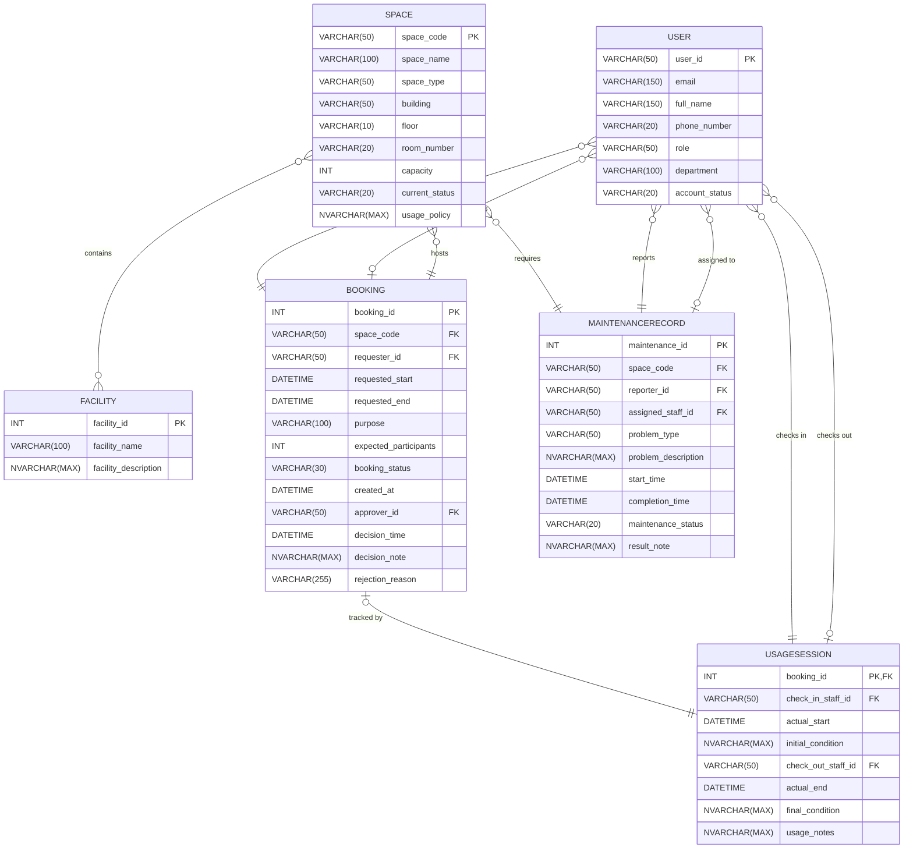

# Step 2: ERD Design — Campus Space Management System

---

## 1. Design Decisions

The Entity-Relationship Diagram (ERD) is rendered using the Mermaid `erDiagram` syntax, which natively supports crow's foot notation to represent cardinalities and participation constraints clearly. Multi-role relationships, such as User interactions with Booking (requesting vs. approving) and UsageSession (checking in vs. checking out), are represented as distinct relationship lines to maintain clarity and adhere to the project's strict role-based requirements. The many-to-many (M:N) relationship between `Space` and `Facility` is depicted via a direct line in this logical model, as Mermaid handles M:N notation effectively; the physical `SpaceFacility` junction table will be implemented during the physical design phase in Step 3. All entities, attributes, and relationships are traced directly from the Business Requirement Analysis (BRA) §3, §4, and §5.

---

## 2. Entity-Relationship Diagram

---

## 3. Relationship Summary Table

| # | Relationship Name | Entity A | Cardinality | Entity B | Notes |
|---|---|---|---|---|---|
| 1 | User_Requests_Booking | User | (0,N) : (1,1) | Booking | Requester role |
| 2 | User_Approves_Booking | User | (0,N) : (0,1) | Booking | Approver role |
| 3 | Space_Hosts_Booking | Space | (0,N) : (1,1) | Booking | Hosting |
| 4 | Space_Equipped_With_Facility | Space | (0,M) : (0,N) | Facility | Catalog mapping |
| 5 | Booking_Has_UsageSession | Booking | (0,1) : (1,1) | UsageSession | 1:1 tracked mapping |
| 6 | User_ChecksIn_UsageSession | User | (0,N) : (1,1) | UsageSession | Check-in staff role |
| 7 | User_ChecksOut_UsageSession | User | (0,N) : (0,1) | UsageSession | Check-out staff role |
| 8 | Space_Requires_Maintenance | Space | (0,N) : (1,1) | MaintenanceRecord | Maintenance event |
| 9 | User_Reports_Maintenance | User | (0,N) : (1,1) | MaintenanceRecord | Reporter role |
| 10 | User_Assigned_To_Maintenance | User | (0,N) : (0,1) | MaintenanceRecord | Technician role |

---

## 4. Attribute Traceability

### User Entity
| Attribute Name | BRA §4 Source |
|---|---|
| user_id | PK / Identifier |
| email | Descriptive |
| full_name | Descriptive |
| phone_number | Descriptive |
| role | Descriptive |
| department | Descriptive |
| account_status | Descriptive |

### Space Entity
| Attribute Name | BRA §4 Source |
|---|---|
| space_code | PK / Identifier |
| space_name | Descriptive |
| space_type | Descriptive |
| building | Descriptive |
| floor | Descriptive |
| room_number | Descriptive |
| capacity | Descriptive |
| current_status | Descriptive |
| usage_policy | Descriptive |

### Facility Entity
| Attribute Name | BRA §4 Source |
|---|---|
| facility_id | PK / Identifier |
| facility_name | Descriptive |
| facility_description | Descriptive |

### Booking Entity
| Attribute Name | BRA §4 Source |
|---|---|
| booking_id | PK / Identifier |
| space_code | FK |
| requester_id | FK |
| requested_start | Descriptive |
| requested_end | Descriptive |
| purpose | Descriptive |
| expected_participants | Descriptive |
| booking_status | Descriptive |
| created_at | Descriptive |
| approver_id | FK |
| decision_time | Descriptive |
| decision_note | Descriptive |
| rejection_reason | Descriptive |

### UsageSession Entity
| Attribute Name | BRA §4 Source |
|---|---|
| booking_id | PK, FK |
| check_in_staff_id | FK |
| actual_start | Descriptive |
| initial_condition | Descriptive |
| check_out_staff_id | FK |
| actual_end | Descriptive |
| final_condition | Descriptive |
| usage_notes | Descriptive |

### MaintenanceRecord Entity
| Attribute Name | BRA §4 Source |
|---|---|
| maintenance_id | PK / Identifier |
| space_code | FK |
| reporter_id | FK |
| assigned_staff_id | FK |
| problem_type | Descriptive |
| problem_description | Descriptive |
| start_time | Descriptive |
| completion_time | Descriptive |
| maintenance_status | Descriptive |
| result_note | Descriptive |
