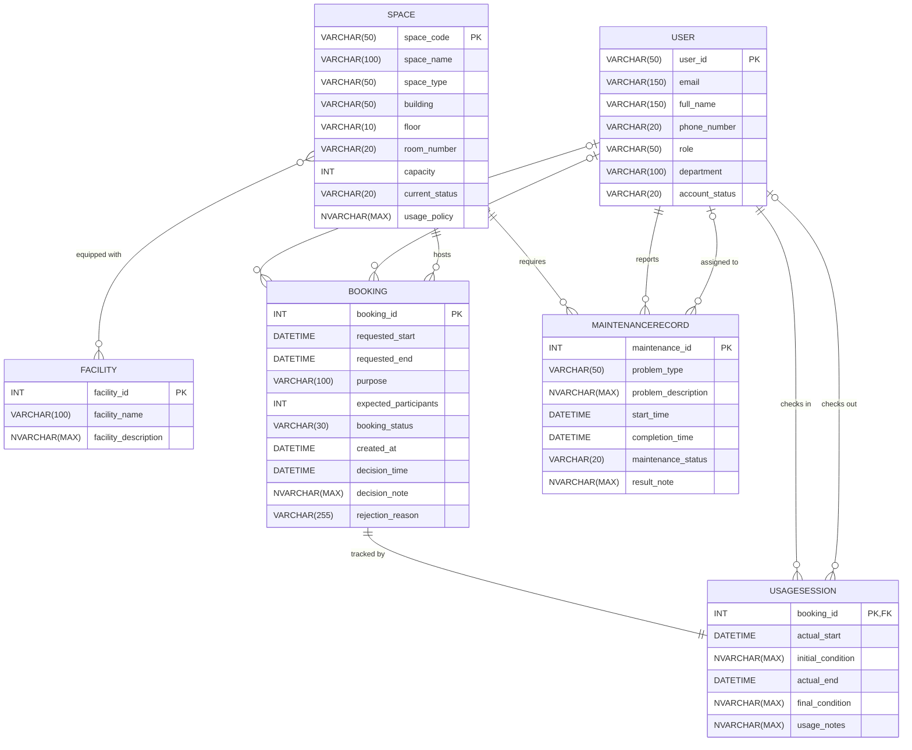

# Step 2: ERD Design — Campus Space Management System

---

## 1. Design Decisions

This design uses the crow's foot notation rendered via Mermaid `erDiagram`. This standard notation is ideal for clearly representing cardinality and participation constraints as defined in the Business Requirement Analysis. Multi-role User relationships (e.g., requester vs. approver) are represented as distinct, labeled relationship lines between the User and the related entity, ensuring each role is explicitly typed. The M:N relationship between Space and Facility is represented by a direct line between the two entities in this conceptual model; the logical junction entity (`SpaceFacility`) will be introduced in the upcoming logical design phase (Step 3).

---

## 2. Entity-Relationship Diagram

---

## 3. Relationship Summary Table

| # | Relationship Name | Entity A | Cardinality | Entity B | Notes |
|---|---|---|---|---|---|
| 1 | User_Requests_Booking | User | (0,N) : (1,1) | Booking | Request role |
| 2 | User_Approves_Booking | User | (0,N) : (0,1) | Booking | Approver role |
| 3 | Space_Hosts_Booking | Space | (0,N) : (1,1) | Booking | Host role |
| 4 | Space_Equipped_With_Facility | Space | (0,M) : (0,N) | Facility | M:N relationship |
| 5 | Booking_Has_UsageSession | Booking | (0,1) : (1,1) | UsageSession | 1:1 mapped |
| 6 | User_ChecksIn_UsageSession | User | (0,N) : (1,1) | UsageSession | Mandatory check-in |
| 7 | User_ChecksOut_UsageSession | User | (0,N) : (0,1) | UsageSession | Optional check-out |
| 8 | Space_Requires_Maintenance | Space | (0,N) : (1,1) | MaintenanceRecord | Space maintenance |
| 9 | User_Reports_Maintenance | User | (0,N) : (1,1) | MaintenanceRecord | Reporter role |
| 10 | User_Assigned_To_Maintenance| User | (0,N) : (0,1) | MaintenanceRecord | Assigned staff role |

---

## 4. Attribute Traceability

### User
| Attribute Name | Source (BRA §4.1) |
|---|---|
| `user_id` | PK / Identifier |
| `email` | Descriptive |
| `full_name` | Descriptive |
| `phone_number` | Descriptive (Nullable) |
| `role` | Descriptive |
| `department` | Descriptive |
| `account_status` | Descriptive |

### Space
| Attribute Name | Source (BRA §4.2) |
|---|---|
| `space_code` | PK / Identifier |
| `space_name` | Descriptive |
| `space_type` | Descriptive |
| `building` | Descriptive |
| `floor` | Descriptive |
| `room_number` | Descriptive |
| `capacity` | Descriptive |
| `current_status` | Descriptive |
| `usage_policy` | Descriptive |

### Facility
| Attribute Name | Source (BRA §4.3) |
|---|---|
| `facility_id` | PK / Identifier |
| `facility_name` | Descriptive |
| `facility_description` | Descriptive |

### Booking
| Attribute Name | Source (BRA §4.4) |
|---|---|
| `booking_id` | PK / Identifier |
| `requested_start` | Descriptive |
| `requested_end` | Descriptive |
| `purpose` | Descriptive |
| `expected_participants` | Descriptive |
| `booking_status` | Descriptive |
| `created_at` | Descriptive |
| `decision_time` | Descriptive (Nullable) |
| `decision_note` | Descriptive (Nullable) |
| `rejection_reason` | Descriptive (Nullable) |

### UsageSession
| Attribute Name | Source (BRA §4.5) |
|---|---|
| `booking_id` | PK / FK |
| `actual_start` | Descriptive |
| `initial_condition` | Descriptive |
| `actual_end` | Descriptive (Nullable) |
| `final_condition` | Descriptive (Nullable) |
| `usage_notes` | Descriptive (Nullable) |

### MaintenanceRecord
| Attribute Name | Source (BRA §4.6) |
|---|---|
| `maintenance_id` | PK / Identifier |
| `problem_type` | Descriptive |
| `problem_description` | Descriptive |
| `start_time` | Descriptive |
| `completion_time` | Descriptive (Nullable) |
| `maintenance_status` | Descriptive |
| `result_note` | Descriptive (Nullable) |
