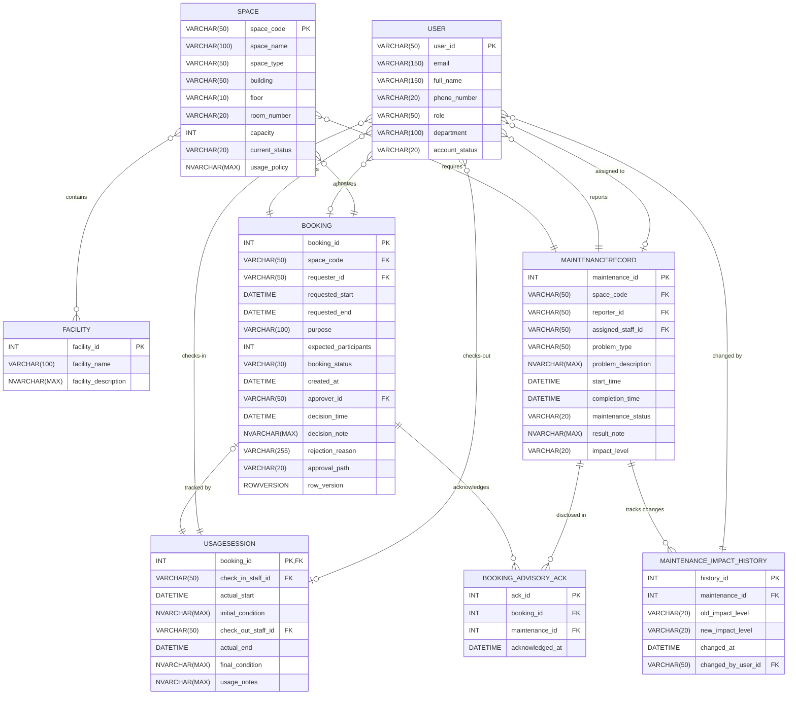

# Step 9: Updated ERD and Logical Design — Campus Space Management System

---

## 1. Change Scope Summary

The following Change Ledger is derived directly from `outputs/08-requirement-change-analysis-G02.md` (Step 8 §2, §4, §5, §6, §8, §9, §11). It defines the authoritative boundary for structural modifications to the Phase 1 conceptual and logical design baseline. Every entity, attribute, relationship, and table not explicitly referenced in this Change Ledger is carried forward from Phase 1 without modification.

| Change ID | Source Step 8 Section | Affected Element | Required Schema Action |
|---|---|---|---|
| C08-01 | §2, §4, §6 (P2-BR-01/02), §9 | `MAINTENANCERECORD` | ADD ATTRIBUTE (`impact_level` as `VARCHAR(20)` with allowed values `'advisory'` / `'out-of-service'`). |
| C08-02 | §2, §4, §5, §6 (P2-BR-03), §9 | `BOOKING` ↔ `MAINTENANCERECORD` | ADD ENTITY (`BOOKING_ADVISORY_ACK`) + ADD RELATIONSHIPS (disclosed advisory acknowledgement at booking time). |
| C08-03 | §2, §4, §5, §6 (P2-BR-05/06), §9, §11 | `MAINTENANCERECORD` | ADD ENTITY (`MAINTENANCE_IMPACT_HISTORY`) + ADD RELATIONSHIPS (retain impact escalation/downgrade history and change audit log). |
| C08-04 | §2, §6, §7 (P2-BR-07, CC-01–03), §9, §11 | `BOOKING` | ADD ATTRIBUTES (`approval_path` as `VARCHAR(20)` and `row_version` as `ROWVERSION` for concurrency schema support only). |
| C08-05 | §2, §6, §8 (P2-BR-08/09), §9 | None structural | NO SCHEMA CHANGE REQUIRED (query implementation, data generator, and index tuning in Steps 14–16). |

---

## 2. Design Decisions and Open-Question Resolutions

In accordance with Step 8 §11 (Open Questions) and Step 9 guidelines for controlled representation choices, the following explicit design decisions have been established prior to constructing the updated ERD and logical schema:

### Decision 1: Maintenance Escalation/Downgrade Representation
* **Quoted Open Question (Step 8 §11 Row 4):** *"Must impact-level changes be retained as a complete history, or is a current escalation action plus immediate affected-booking result sufficient?"*
* **Chosen Representation:** Retain complete impact change events in a dedicated audit entity `MAINTENANCE_IMPACT_HISTORY` (`history_id`, `maintenance_id`, `old_impact_level`, `new_impact_level`, `changed_at`, `changed_by_user_id`).
* **Rationale:** Phase 2 BRA §1.1 states that open maintenance records may be escalated or downgraded, and escalations must identify overlapping approved bookings. Storing an explicit change log guarantees an auditable timestamp (`changed_at`) and actor log (`changed_by_user_id`) for every escalation event. This directly supports Report 4 ("approved bookings affected by escalation") without destroying historical status progression or altering current operational checks on `MAINTENANCERECORD.impact_level`.
* **Traceability & Step 8 Alignment:** Aligns with Step 8 §11 Working Assumption by explicitly choosing a historical retention model rather than leaving history implicit.

### Decision 2: Advisory Disclosure and Acknowledgement Representation
* **Quoted Open Question (Step 8 §4 Candidate Entity):** Representation of booking-to-advisory disclosure/acknowledgement information required by P2-BR-03.
* **Chosen Representation:** Create a junction entity `BOOKING_ADVISORY_ACK` (`ack_id`, `booking_id`, `maintenance_id`, `acknowledged_at`).
* **Rationale:** A single campus space may have multiple active advisory maintenance records simultaneously (P2-BR-04). A single boolean flag or simple note on `BOOKING` cannot prove *which* specific active advisories were presented to the requester at submission time. Establishing a dedicated associative entity allows M:N linkage between bookings and active advisory records, providing an immutable audit record (`acknowledged_at`) of every advisory disclosed and accepted.
* **Traceability & Step 8 Alignment:** Directly satisfies P2-BR-03 and Step 8 §4 candidate new entity requirements.

### Decision 3: Approval Path Representation
* **Quoted Open Question (Step 8 §11 Row 3):** *"Which space types and policy conditions qualify for instant approval, and must the approval path be stored?"*
* **Chosen Representation:** Add an explicit column `approval_path VARCHAR(20) NOT NULL` to `BOOKING` with CHECK constraint `approval_path IN ('Instant', 'Staff')` (Default: `'Staff'`).
* **Rationale:** Phase 2 BRA introduces automatic instant approval for qualifying space types alongside the existing staff approval workflow. Storing `approval_path` explicitly distinguishes instant approvals from staff decisions without introducing synthetic "system" staff accounts or relying on `approver_id IS NULL` (which would be ambiguous with pending requests). For `'Instant'` approvals, `approver_id` remains NULL; for `'Staff'` approvals, `approver_id` records the approving staff member's `user_id`.
* **Traceability & Step 8 Alignment:** Aligns with Step 8 §11 Working Assumption 3 and P2-BR-07 while preserving Phase 1 staff decision auditability.

### Decision 4: Concurrency-Support Schema Boundary
* **Quoted Requirement (Change C08-04 / Step 8 §9):** Add schema support columns for concurrency control without implementing application or procedural mechanisms.
* **Chosen Representation:** Add `row_version ROWVERSION NOT NULL` to `BOOKING`.
* **Rationale:** To support future concurrency control (CC-01 through CC-03) during simultaneous instant and staff booking approvals, adding a native `ROWVERSION` column to `BOOKING` provides database-level version tracking. This column automatically updates upon any modifications to a booking record.
* **Scope Boundary Confirmation:** This schema addition provides structural data support only. No locking hints, transaction isolation levels, triggers, or procedural concurrency mechanisms are implemented in Step 9; those are strictly reserved for Steps 11–13 per Step 8 §9.

---

## 3. Updated Entity-Relationship Diagram

The complete updated Entity-Relationship Diagram is rendered below using Mermaid `erDiagram` syntax in Crow's Foot notation. Unchanged entities and relationships retain their Phase 1 baseline structure and BRA section comments. All new or modified entity blocks and relationship lines are annotated with their corresponding Step 8 Change IDs.

---

## 4. Relationship Delta Summary

The following table summarizes all 14 relationships in the updated conceptual model, detailing cardinality, status relative to Phase 1, and traceability:

| # | Relationship Name | Entity A | Cardinality | Entity B | Status | Traces To | Notes |
|---|---|---|---|---|---|---|---|
| 1 | User_Requests_Booking | USER | (0,N) : (1,1) | BOOKING | UNCHANGED | BRA §5.1 | User submits booking request |
| 2 | User_Approves_Booking | USER | (0,N) : (0,1) | BOOKING | UNCHANGED | BRA §5.2 | Staff approves booking request |
| 3 | Space_Hosts_Booking | SPACE | (0,N) : (1,1) | BOOKING | UNCHANGED | BRA §5.3 | Space hosts booking request |
| 4 | Space_Contains_Facility | SPACE | (0,M) : (0,N) | FACILITY | UNCHANGED | BRA §5.4 | M:N relationship resolved in logical schema |
| 5 | Booking_Has_UsageSession | BOOKING | (0,1) : (1,1) | USAGESESSION | UNCHANGED | BRA §5.5 | 1:1 usage session tracking |
| 6 | User_ChecksIn_UsageSession | USER | (0,N) : (1,1) | USAGESESSION | UNCHANGED | BRA §5.6 | Staff checks-in usage session |
| 7 | User_ChecksOut_UsageSession | USER | (0,N) : (0,1) | USAGESESSION | UNCHANGED | BRA §5.7 | Staff checks-out usage session |
| 8 | Space_Requires_Maintenance | SPACE | (0,N) : (1,1) | MAINTENANCERECORD | UNCHANGED | BRA §5.8 | Space requires maintenance |
| 9 | User_Reports_Maintenance | USER | (0,N) : (1,1) | MAINTENANCERECORD | UNCHANGED | BRA §5.9 | User reports maintenance issue |
| 10 | User_Assigned_To_Maintenance | USER | (0,N) : (0,1) | MAINTENANCERECORD | UNCHANGED | BRA §5.10 | Staff assigned to maintenance task |
| 11 | Booking_Acknowledges_Advisory | BOOKING | (0,N) : (1,1) | BOOKING_ADVISORY_ACK | NEW | Change ID C08-02 (P2-BR-03) | Booking acknowledges disclosed advisory |
| 12 | Maintenance_Disclosed_In_Ack | MAINTENANCERECORD | (0,N) : (1,1) | BOOKING_ADVISORY_ACK | NEW | Change ID C08-02 (P2-BR-03) | Advisory maintenance record disclosed in acknowledgement |
| 13 | Maintenance_Has_Impact_History | MAINTENANCERECORD | (0,N) : (1,1) | MAINTENANCE_IMPACT_HISTORY | NEW | Change ID C08-03 (P2-BR-05/06) | Maintenance record impact changes tracked |
| 14 | User_Changes_Maintenance_Impact | USER | (0,N) : (1,1) | MAINTENANCE_IMPACT_HISTORY | NEW | Change ID C08-03 (P2-BR-05/06) | Staff/Manager alters maintenance impact level |

---

## 5. Updated Logical Schema

### 5.1 Modified Tables

#### 5.1.1 Table: BOOKING (Modified)
Represents space reservation requests. Extended in Phase 2 with approval path classification and automatic concurrency row versioning.

| Column Name | SQL Server Data Type | Nullability | Key | Constraints | Description | Change |
| :--- | :--- | :--- | :--- | :--- | :--- | :--- |
| `booking_id` | `INT` | NOT NULL | PK | PRIMARY KEY | Unique auto-incrementing identifier. | — |
| `space_code` | `VARCHAR(50)` | NOT NULL | FK | FK references `SPACE(space_code)` | The space being requested. | — |
| `requester_id` | `VARCHAR(50)` | NOT NULL | FK | FK references `USER(user_id)` | The user submitting the request. | — |
| `requested_start` | `DATETIME` | NOT NULL | - | CHECK | Requested start timestamp (must be >= created_at). | — |
| `requested_end` | `DATETIME` | NOT NULL | - | CHECK | Requested end timestamp (must be > start). | — |
| `purpose` | `VARCHAR(100)` | NOT NULL | - | CHECK | Purpose of use constraint (Lecture, Meeting, Exam, etc.). | — |
| `expected_participants` | `INT` | NOT NULL | - | CHECK | Projected attendee count (must be > 0 and <= space capacity). | — |
| `booking_status` | `VARCHAR(30)` | NOT NULL | - | CHECK | Request processing status (Pending, Approved, Rejected, etc.). | — |
| `created_at` | `DATETIME` | NOT NULL | - | DEFAULT | Time request was created. Defaults to `GETDATE()`. | — |
| `approver_id` | `VARCHAR(50)` | NULL | FK | FK references `USER(user_id)` | Staff who approved/rejected. NULL for instant approval or pending. | — |
| `decision_time` | `DATETIME` | NULL | - | - | Time decision was recorded. Nullable. | — |
| `decision_note` | `NVARCHAR(MAX)` | NULL | - | - | Staff review notes. Nullable. | — |
| `rejection_reason` | `VARCHAR(255)` | NULL | - | CHECK | Explanation of rejection (mandatory if status is Rejected). | — |
| `approval_path` | `VARCHAR(20)` | NOT NULL | - | DEFAULT 'Staff', CHECK | Indicates approval workflow path (`'Instant'` or `'Staff'`). | NEW (C08-04, Res. #3) |
| `row_version` | `ROWVERSION` | NOT NULL | - | - | SQL Server concurrency token for optimistic locking checks. | NEW (C08-04, Res. #4) |

#### 5.1.2 Table: MAINTENANCERECORD (Modified)
Logs reported issues, scheduled downtime, and repair tasks for physical spaces. Extended in Phase 2 to store impact level.

| Column Name | SQL Server Data Type | Nullability | Key | Constraints | Description | Change |
| :--- | :--- | :--- | :--- | :--- | :--- | :--- |
| `maintenance_id` | `INT` | NOT NULL | PK | PRIMARY KEY | Unique auto-incrementing identifier. | — |
| `space_code` | `VARCHAR(50)` | NOT NULL | FK | FK references `SPACE(space_code)` | Space undergoing maintenance. | — |
| `reporter_id` | `VARCHAR(50)` | NOT NULL | FK | FK references `USER(user_id)` | User who reported the problem. | — |
| `assigned_staff_id` | `VARCHAR(50)` | NULL | FK | FK references `USER(user_id)` | Staff technician assigned to resolve. Nullable. | — |
| `problem_type` | `VARCHAR(50)` | NOT NULL | - | CHECK | Problem type constraint (Projector Failure, etc.). | — |
| `problem_description` | `NVARCHAR(MAX)` | NOT NULL | - | - | Free-text details of the issue. | — |
| `start_time` | `DATETIME` | NOT NULL | - | - | Timestamp when maintenance started. | — |
| `completion_time` | `DATETIME` | NULL | - | CHECK | Timestamp when maintenance resolved (must be > start). | — |
| `maintenance_status` | `VARCHAR(20)` | NOT NULL | - | CHECK | Maintenance stage constraint (Reported, In Progress, Resolved, Cancelled). | — |
| `result_note` | `NVARCHAR(MAX)` | NULL | - | - | Summary of repairs or outcomes. Nullable. | — |
| `impact_level` | `VARCHAR(20)` | NOT NULL | - | DEFAULT 'out-of-service', CHECK | Maintenance impact constraint (`'advisory'` or `'out-of-service'`). | NEW (C08-01, P2-BR-01/02) |

---

### 5.2 New Tables

#### 5.2.1 Table: BOOKING_ADVISORY_ACK
Associative table linking bookings to active advisory maintenance records disclosed at submission time, capturing mandatory requester acknowledgement.

| Column Name | SQL Server Data Type | Nullability | Key | Constraints | Description |
| :--- | :--- | :--- | :--- | :--- | :--- |
| `ack_id` | `INT` | NOT NULL | PK | PRIMARY KEY | Unique auto-incrementing identifier. |
| `booking_id` | `INT` | NOT NULL | FK | FK references `BOOKING(booking_id)` | The booking request associated with the acknowledgement. |
| `maintenance_id` | `INT` | NOT NULL | FK | FK references `MAINTENANCERECORD(maintenance_id)` | The active advisory maintenance record presented to the requester. |
| `acknowledged_at` | `DATETIME` | NOT NULL | - | DEFAULT | Timestamp when acknowledgement was recorded. Defaults to `GETDATE()`. |

*Keys and Constraints:*
* Primary Key: `ack_id` (`INT IDENTITY`)
* Alternate Key: `UQ_BOOKING_MAINTENANCE_ACK UNIQUE (booking_id, maintenance_id)` — prevents duplicate disclosure logs for the same booking and maintenance record.
* Foreign Keys: `FK_ACK_BOOKING` references `BOOKING(booking_id)` (`ON DELETE NO ACTION`), `FK_ACK_MAINTENANCE` references `MAINTENANCERECORD(maintenance_id)` (`ON DELETE NO ACTION`).

#### 5.2.2 Table: MAINTENANCE_IMPACT_HISTORY
Audit table recording all impact-level changes (escalations from advisory to out-of-service, or downgrades) over the lifecycle of a maintenance record.

| Column Name | SQL Server Data Type | Nullability | Key | Constraints | Description |
| :--- | :--- | :--- | :--- | :--- | :--- |
| `history_id` | `INT` | NOT NULL | PK | PRIMARY KEY | Unique auto-incrementing identifier. |
| `maintenance_id` | `INT` | NOT NULL | FK | FK references `MAINTENANCERECORD(maintenance_id)` | The maintenance record whose impact level was changed. |
| `old_impact_level` | `VARCHAR(20)` | NOT NULL | - | CHECK | Impact level prior to change (`'advisory'` or `'out-of-service'`). |
| `new_impact_level` | `VARCHAR(20)` | NOT NULL | - | CHECK | New impact level after change (`'advisory'` or `'out-of-service'`). |
| `changed_at` | `DATETIME` | NOT NULL | - | DEFAULT | Timestamp of the escalation/downgrade event. Defaults to `GETDATE()`. |
| `changed_by_user_id` | `VARCHAR(50)` | NOT NULL | FK | FK references `USER(user_id)` | Staff or manager who modified the impact level. |

*Keys and Constraints:*
* Primary Key: `history_id` (`INT IDENTITY`)
* Check Constraints: `CK_HIST_OLD_IMPACT` (`old_impact_level IN ('advisory', 'out-of-service')`), `CK_HIST_NEW_IMPACT` (`new_impact_level IN ('advisory', 'out-of-service')`).
* Foreign Keys: `FK_HIST_MAINTENANCE` references `MAINTENANCERECORD(maintenance_id)` (`ON DELETE NO ACTION`), `FK_HIST_USER` references `USER(user_id)` (`ON DELETE NO ACTION`).

---

### 5.3 Concurrency Schema Note

This logical design introduces structural schema columns (`BOOKING.row_version` and `BOOKING.approval_path`) to enable atomic conflict detection across instant and staff approval paths. In accordance with Step 8 §9 (C08-04) and Phase 2 workflow rules, this step defines **schema support only**. No transaction isolation levels, row locking hints, triggers, or procedural concurrency control mechanisms are implemented in Step 9; those are strictly scoped to Steps 11–13 (Concurrency Design, Implementation, and Testing).

---

## 6. Attribute Traceability (New/Changed Only)

The following tables trace every new or modified attribute back to its governing Step 8 Change ID, section, requirement, or Stage 1 design decision:

### Entity: BOOKING (Modified)
| Attribute | Data Type | Source / Traceability | Purpose |
|---|---|---|---|
| `approval_path` | `VARCHAR(20)` | Change ID C08-04, Step 8 §6 (P2-BR-07), Stage 1 Decision #3 | Distinguishes `'Instant'` approval from `'Staff'` approval. |
| `row_version` | `ROWVERSION` | Change ID C08-04, Step 8 §7 (CC-01–03), Stage 1 Decision #4 | Provides automatic version tracking for optimistic concurrency control. |

### Entity: MAINTENANCERECORD (Modified)
| Attribute | Data Type | Source / Traceability | Purpose |
|---|---|---|---|
| `impact_level` | `VARCHAR(20)` | Change ID C08-01, Step 8 §6 (P2-BR-01/02), Phase 2 BRA §1.1 | Stores impact level (`'advisory'` vs `'out-of-service'`). |

### Entity: BOOKING_ADVISORY_ACK (New Entity)
| Attribute | Data Type | Source / Traceability | Purpose |
|---|---|---|---|
| `ack_id` | `INT` | Stage 1 Decision #2 (Surrogate PK) | Primary key for acknowledgement log entry. |
| `booking_id` | `INT` | Change ID C08-02, Step 8 §4, P2-BR-03 | Foreign key referencing the booking request. |
| `maintenance_id` | `INT` | Change ID C08-02, Step 8 §4, P2-BR-03 | Foreign key referencing the disclosed advisory maintenance record. |
| `acknowledged_at` | `DATETIME` | Change ID C08-02, Step 8 §4, P2-BR-03, Stage 1 Decision #2 | Timestamp when acknowledgement was recorded. |

### Entity: MAINTENANCE_IMPACT_HISTORY (New Entity)
| Attribute | Data Type | Source / Traceability | Purpose |
|---|---|---|---|
| `history_id` | `INT` | Stage 1 Decision #1 (Surrogate PK) | Primary key for impact change audit entry. |
| `maintenance_id` | `INT` | Change ID C08-03, Step 8 §4, P2-BR-05/06 | Foreign key referencing the maintenance record. |
| `old_impact_level` | `VARCHAR(20)` | Change ID C08-03, Step 8 §6 (P2-BR-05), Stage 1 Decision #1 | Impact level prior to escalation or downgrade. |
| `new_impact_level` | `VARCHAR(20)` | Change ID C08-03, Step 8 §6 (P2-BR-05), Stage 1 Decision #1 | Impact level after escalation or downgrade. |
| `changed_at` | `DATETIME` | Change ID C08-03, Step 8 §6 (P2-BR-05/06), Stage 1 Decision #1 | Timestamp of impact change event. |
| `changed_by_user_id` | `VARCHAR(50)` | Change ID C08-03, Step 8 §3/§4, Stage 1 Decision #1 | Foreign key referencing staff member who modified impact. |
