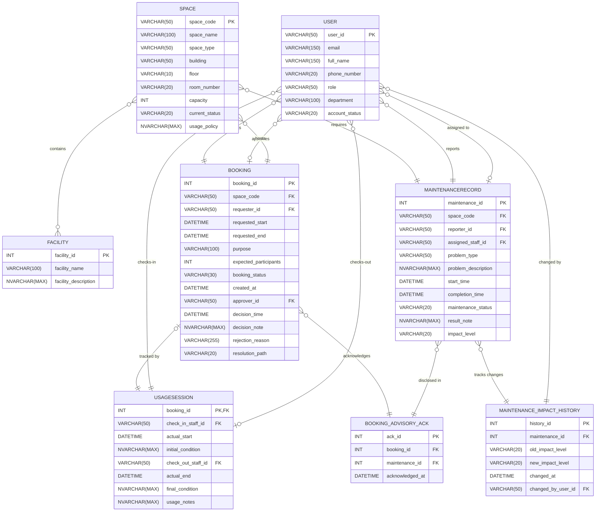

# Step 9: Updated ERD and Logical Design — Campus Space Management System

---

## 1. Change Scope Summary

The following Change Ledger is derived directly from `outputs/08-requirement-change-analysis-G02.md` (Step 8 §2, §4, §5, §6, §8, §9, §11). It defines the authoritative boundary for structural modifications to the Phase 1 conceptual and logical design baseline. Every entity, attribute, relationship, and table not explicitly referenced in this Change Ledger is carried forward from Phase 1 without modification.

| Change ID | Source Step 8 Section | Affected Element | Required Schema Action |
|---|---|---|---|
| C08-01 | §2, §4, §6 (P2-BR-01/02), §9 | `MAINTENANCERECORD` | ADD ATTRIBUTE (`impact_level` as `VARCHAR(20)` with allowed values `'advisory'` / `'out-of-service'`). |
| C08-02 | §2, §4, §5, §6 (P2-BR-03), §9 | `BOOKING` ↔ `MAINTENANCERECORD` | ADD ENTITY (`BOOKING_ADVISORY_ACK`) + ADD RELATIONSHIPS (disclosed advisory acknowledgement at booking time). |
| C08-03 | §2, §4, §5, §6 (P2-BR-05/06), §9, §11 | `MAINTENANCERECORD` | ADD ENTITY (`MAINTENANCE_IMPACT_HISTORY`) + ADD RELATIONSHIPS (retain impact escalation/downgrade history and change audit log). |
| C08-04 | §2, §6, §7 (P2-BR-07, CC-01–03), §9, §11 | `BOOKING` | ADD ATTRIBUTE (`resolution_path` as `VARCHAR(20)`). CC-01–CC-03 is a cross-row phantom-overlap conflict, not a single-row update conflict; per Step 8 §9's downstream map, Step 9 retains the design facts needed by both approval paths and defers the concurrency mechanism itself to Steps 11–13. No per-row version column is added (corrected per review R09-5; see Decision 4). |
| C08-05 | §2, §6, §8 (P2-BR-08/09), §9 | None structural | NO SCHEMA CHANGE REQUIRED (query implementation, data generator, and index tuning in Steps 14–16). |
| C08-06 | §6 (P2-BR-10/11) — *no corresponding §2 row exists in the current Step 8 document; this Change ID is assigned here to preserve traceability per this skill's Bounded Invention rule* | `BOOKING` |  ADD write-once constraint documentation for `resolution_path` (P2-BR-11). Eligibility for `'Instant'` resolution (P2-BR-10: `space_type = 'Classroom'` AND requester role AND `usage_policy` constraints satisfied) is evaluated at resolution time against existing `SPACE.space_type`, `SPACE.usage_policy`, and `USER.role` — no new column required for eligibility itself. |

---

## 2. Design Decisions and Open-Question Resolutions

In accordance with Step 8 §11 (Open Questions) and Step 9 guidelines for controlled representation choices, the following explicit design decisions have been established prior to constructing the updated ERD and logical schema:

### Decision 1: Maintenance Escalation/Downgrade Representation
* **Quoted Open Question (Step 8 §11 Row 4):** *"Must impact-level changes be retained as a complete history, or is a current escalation action plus immediate affected-booking result sufficient?"*
* **Chosen Representation:** Retain complete impact change events in a dedicated audit entity `MAINTENANCE_IMPACT_HISTORY` (`history_id`, `maintenance_id`, `old_impact_level`, `new_impact_level`, `changed_at`, `changed_by_user_id`).
* **Rationale:** Phase 2 BRA §1.1 states that open maintenance records may be escalated or downgraded, and escalations must identify overlapping approved bookings. Storing an explicit change log guarantees an auditable timestamp (`changed_at`) and actor log (`changed_by_user_id`) for every escalation event. This directly supports Report 4 ("approved bookings affected by escalation") without destroying historical status progression or altering current operational checks on `MAINTENANCERECORD.impact_level`.
* **Traceability & Step 8 Alignment:** Aligns with Step 8 §11 Working Assumption by explicitly choosing a historical retention model rather than leaving history implicit.

### Decision 2: Advisory Disclosure and Acknowledgement Representation
* **Quoted Open Question (Step 8 §4 Candidate Entity):** Representation of booking-to-advisory disclosure/acknowledgement information required by P2-BR-03.
* **Chosen Representation:** Create a junction entity `BOOKING_ADVISORY_ACK` (`ack_id`, `booking_id`, `maintenance_id`, `acknowledged_at`).
* **Rationale:** A single campus space may have multiple active advisory maintenance records simultaneously (P2-BR-04). A single boolean flag or simple note on `BOOKING` cannot prove *which* specific active advisories were presented to the requester at submission time. Establishing a dedicated associative entity allows M:N linkage between bookings and active advisory records, providing an immutable audit record (`acknowledged_at`) of every advisory disclosed and accepted.
* **Traceability & Step 8 Alignment:** Directly satisfies P2-BR-03 and Step 8 §4 candidate new entity requirements.

### Decision 3: Resolution Path Representation
* **Quoted Open Question (Step 8 §11 Row 3):** *"Which space types and policy conditions qualify for instant approval, and must the approval path be stored?"*
* **Chosen Representation:** Add an explicit column `resolution_path VARCHAR(20) NOT NULL` to `BOOKING` with CHECK constraint `resolution_path IN ('Instant', 'Staff')` (Default: `'Staff'`).
* **Rationale:** Phase 2 BRA introduces automatic instant approval for qualifying requests alongside the existing staff approval workflow. Storing `resolution_path` explicitly distinguishes instant approvals from staff decisions without introducing synthetic "system" staff accounts or relying on `approver_id IS NULL` (which would be ambiguous with pending requests). For `'Instant'` resolutions, `approver_id` remains NULL; for `'Staff'` resolutions, `approver_id` records the approving staff member's `user_id`.
* **Naming Update (C08-06 / P2-BR-10, P2-BR-11):** Renamed from `approval_path` to `resolution_path` to reduce ambiguity between "the path a request takes" and "an approval decision," since Phase 2 now also formally governs rejection/immutability behavior for this same attribute (see Decision 7).
* **Assignment Timing (corrected per review R09-2):** `resolution_path` is evaluated and assigned exactly once, at the same transaction that inserts the `BOOKING` row: eligibility (Decision 7 / P2-BR-10) is checked at submission time, and the column is set to `'Instant'` if all conditions hold or defaults to `'Staff'` otherwise. It is never assigned or re-assigned later, including at the moment a staff decision is recorded. A full status/path/decision-field matrix is defined in §5.5 below.
* **Traceability & Step 8 Alignment:** Aligns with Step 8 §11 Working Assumption 3 and P2-BR-07 while preserving Phase 1 staff decision auditability.

### Decision 4: Concurrency-Support Schema Boundary (revised per review R09-5)
* **Quoted Requirement (Step 8 §9 downstream map, C08-04 row):** "Retain design facts needed by both approval paths without implementing the mechanism" — Step 9 is not asked to add a concurrency-control column.
* **Why a `row_version`/`ROWVERSION` column was removed:** Step 8 §7 defines CC-01–CC-03 as conflicts *between two different rows* being concurrently inserted/approved for the same `space_code` and overlapping period (a phantom-read/insert problem), not as two transactions concurrently updating the *same* `BOOKING` row (a lost-update problem). A per-row optimistic-concurrency token only ever detects the latter, so it provides no protection against CC-01–CC-03 and its earlier "atomic conflict detection" claim was inaccurate. No separate lost-update scenario is documented in Step 8 that would justify the column on its own.
* **Chosen Representation:** No new column is added to `BOOKING` for concurrency in Step 9. Concurrency readiness is instead described structurally: the shared, contended resource for CC-01–CC-03 is the combination of `SPACE.space_code` and the requested time range across `BOOKING` rows for that space — this is what Steps 11–13 must protect atomically (e.g., via serializable isolation, range/key locking, or a centralized approval transaction), consistent with the "candidate mechanisms... are implementation alternatives for Steps 11-13" note in Step 8 §7.
* **Scope Boundary Confirmation:** Step 9 makes no structural or procedural concurrency addition. The mechanism selection and implementation remain entirely in Steps 11–13 per Step 8 §9.

### Decision 5: Semester Scope Representation
* **Quoted Open Question (Step 8 §11 Row 1):** *"What defines a semester: supplied start/end parameters, a maintained academic-calendar entity, or another authoritative source?"*
* **Chosen Representation:** Treat semester boundaries as report input parameters (`@semester_start DATETIME`, `@semester_end DATETIME`) in analytical queries (Reports 1 and 2), rather than introducing a stored `ACADEMIC_CALENDAR` or `SEMESTER` table into the relational schema.
* **Rationale:** Phase 2 BRA §1.3 asks for reports "for a given semester" but does not define or require a persistent academic calendar table. Supplying date parameters avoids adding ungrounded administrative entities to the database schema while providing complete flexibility for any semester date range.
* **Traceability & Step 8 Alignment:** Adheres directly to Step 8 §11 Working Assumption 1.

### Decision 6: Active Advisory Status Scope
* **Quoted Open Question (Step 8 §11 Row 5):** *"Does 'active advisory at booking time' include maintenance in Reported and In Progress only, as Phase 1 treated active maintenance, or another status/time definition?"*
* **Chosen Representation:** Active advisories subject to disclosure and acknowledgement at booking time are defined as `MAINTENANCERECORD` rows where `maintenance_status IN ('Reported', 'In Progress')` AND `impact_level = 'advisory'` AND the requested booking period overlaps the maintenance period.
* **Rationale:** Preserves consistency with Phase 1 baseline logic where active maintenance is represented by open statuses (`Reported`, `In Progress`), while filtering specifically for `impact_level = 'advisory'` per P2-BR-02/03.
* **Traceability & Step 8 Alignment:** Adheres directly to Step 8 §11 Working Assumption 5 and P2-BR-03.

### Decision 7: Resolution-Path Eligibility Basis and Write-Once Constraint
* **Quoted Requirement (Step 8 §6, P2-BR-10):** *"Classroom booking requests submitted by users with the Lecturer or Teaching Assistant role must be approved automatically at submission time, provided that all applicable availability, capacity, maintenance, and usage-policy constraints are satisfied."*
* **Quoted Requirement (Step 8 §6, P2-BR-11):** *"Once a booking's resolution path has been assigned, it must not be changed or cleared."*
* **Chosen Representation:** `SPACE.usage_policy` is retained unchanged from the Phase 1 baseline. `resolution_path = 'Instant'` eligibility is evaluated at resolution time as the conjunction of: (1) `SPACE.space_type = 'Classroom'` for the requested space, (2) `USER.role IN ('Lecturer', 'Teaching Assistant')` for the requester, and (3) all applicable availability, capacity, maintenance, and `SPACE.usage_policy` constraints being satisfied. All three conditions are evaluated against existing Phase 1 columns; no new eligibility column is introduced. `resolution_path` itself is documented as write-once: it is evaluated and assigned exactly once, at INSERT time (see Decision 3's Assignment Timing note and §5.5), and is never altered by a subsequent UPDATE — including when a staff decision is later recorded on the same row.
* **Rationale:** P2-BR-10 names `space_type` and `usage_policy` explicitly alongside the role condition, so all three remain load-bearing in the eligibility decision — role eligibility narrows *which* bookings can be instant-resolved, it does not substitute for the existing space-type and policy checks. Retaining `usage_policy` unchanged keeps this decision fully aligned with the literal Step 8 text.
* **Write-once enforcement scope:** Per Step 8 §9's downstream map for this rule (Steps 9–12), Step 9's responsibility is limited to documenting the write-once requirement and shaping the schema to support it (see §5.4 below); the actual enforcement mechanism (e.g., an `INSTEAD OF UPDATE` or `AFTER UPDATE` trigger rejecting any write to `resolution_path`) is Step 10/12 scope, consistent with how Decision 4 defers concurrency mechanism choice to Steps 11–13.
* **Traceability:** C08-06 (locally assigned — recommend the group formally add this to Step 8 §2; see §1), P2-BR-10, P2-BR-11.

---

## 3. Updated Entity-Relationship Diagram

---
 
## 4. Relationship Delta Summary
 The following table summarizes all 14 relationships in the updated conceptual model, detailing cardinality, status relative to Phase 1, and traceability:
| # | Relationship Name | Entity A | Cardinality | Entity B | Status | Traces To | Notes |
|---|---|---|---|---|---|---|---|
| 1 | User_Requests_Booking | USER | (0,N) : (1,1) | BOOKING | UNCHANGED | BRA §5.1 | User submits booking request |
| 2 | User_Approves_Booking | USER | (0,N) : (0,1) | BOOKING | UNCHANGED | BRA §5.2 | Staff approves booking request |
| 3 | Space_Hosts_Booking | SPACE | (0,N) : (1,1) | BOOKING | UNCHANGED | BRA §5.3 | Space hosts booking request |
| 4 | Space_Contains_Facility | SPACE | (0,M) : (0,N) | FACILITY | UNCHANGED | BRA §5.4 | M:N relationship resolved in logical schema |
| 5 | Booking_Has_UsageSession | BOOKING | (0,1) : (1,1) | USAGESESSION | UNCHANGED | BRA §5.5 | 1:1 usage session tracking |
| 6 | User_ChecksIn_UsageSession | USER | (0,N) : (1,1) | USAGESESSION | UNCHANGED | BRA §5.6 | Staff checks-in usage session |
| 7 | User_ChecksOut_UsageSession | USER | (0,N) : (0,1) | USAGESESSION | UNCHANGED | BRA §5.7 | Staff checks-out usage session |
| 8 | Space_Requires_Maintenance | SPACE | (0,N) : (1,1) | MAINTENANCERECORD | UNCHANGED | BRA §5.8 | Space requires maintenance |
| 9 | User_Reports_Maintenance | USER | (0,N) : (1,1) | MAINTENANCERECORD | UNCHANGED | BRA §5.9 | User reports maintenance issue |
| 10 | User_Assigned_To_Maintenance | USER | (0,N) : (0,1) | MAINTENANCERECORD | UNCHANGED | BRA §5.10 | Staff assigned to maintenance task |
| 11 | Booking_Acknowledges_Advisory | BOOKING | (0,N) : (1,1) | BOOKING_ADVISORY_ACK | NEW | Change ID C08-02 (P2-BR-03) | A booking may have zero or many advisory acknowledgements; each acknowledgement belongs to exactly one booking (`booking_id NOT NULL FK`) |
| 12 | Maintenance_Disclosed_In_Ack | MAINTENANCERECORD | (0,N) : (1,1) | BOOKING_ADVISORY_ACK | NEW | Change ID C08-02 (P2-BR-03) | An advisory maintenance record may be disclosed in zero or many acknowledgements; each acknowledgement discloses exactly one maintenance record (`maintenance_id NOT NULL FK`) |
| 13 | Maintenance_Has_Impact_History | MAINTENANCERECORD | (0,N) : (1,1) | MAINTENANCE_IMPACT_HISTORY | NEW | Change ID C08-03 (P2-BR-05/06) | A maintenance record may have zero or many impact-change history entries; each entry belongs to exactly one maintenance record (`maintenance_id NOT NULL FK`) |
| 14 | User_Changes_Maintenance_Impact | USER | (0,N) : (1,1) | MAINTENANCE_IMPACT_HISTORY | NEW | Change ID C08-03 (P2-BR-05/06) | A user may make zero or many impact changes; each history entry records exactly one changing user (`changed_by_user_id NOT NULL FK`) |
 
---

## 5. Updated Logical Schema

### 5.1 Modified Tables

#### 5.1.1 Table: BOOKING (Modified)
Represents space reservation requests. Extended in Phase 2 with resolution path classification.
| Column Name | SQL Server Data Type | Nullability | Key | Constraints | Description | Change |
| :--- | :--- | :--- | :--- | :--- | :--- | :--- |
| `booking_id` | `INT` | NOT NULL | PK | PRIMARY KEY | Unique auto-incrementing identifier. | — |
| `space_code` | `VARCHAR(50)` | NOT NULL | FK | FK references `SPACE(space_code)` | The space being requested. | — |
| `requester_id` | `VARCHAR(50)` | NOT NULL | FK | FK references `USER(user_id)` | The user submitting the request. | — |
| `requested_start` | `DATETIME` | NOT NULL | - | CHECK | Requested start timestamp (must be >= created_at). | — |
| `requested_end` | `DATETIME` | NOT NULL | - | CHECK | Requested end timestamp (must be > start). | — |
| `purpose` | `VARCHAR(100)` | NOT NULL | - | CHECK | Purpose of use constraint (Lecture, Meeting, Exam, etc.). | — |
| `expected_participants` | `INT` | NOT NULL | - | CHECK | Projected attendee count (must be > 0 and <= space capacity). | — |
| `booking_status` | `VARCHAR(30)` | NOT NULL | - | CHECK | Request processing status (Pending, Approved, Rejected, etc.). | — |
| `created_at` | `DATETIME` | NOT NULL | - | DEFAULT | Time request was created. Defaults to `GETDATE()`. | — |
| `approver_id` | `VARCHAR(50)` | NULL | FK | FK references `USER(user_id)` | Staff who approved/rejected. NULL for instant approval or pending. | — |
| `decision_time` | `DATETIME` | NULL | - | - | Time decision was recorded. Nullable. | — |
| `decision_note` | `NVARCHAR(MAX)` | NULL | - | - | Staff review notes. Nullable. | — |
| `rejection_reason` | `VARCHAR(255)` | NULL | - | CHECK | Explanation of rejection (mandatory if status is Rejected). | — |
| `resolution_path` | `VARCHAR(20)` | NOT NULL | - | DEFAULT 'Staff', CHECK, WRITE-ONCE (see §5.5) | Indicates resolution workflow path (`'Instant'` or `'Staff'`). Set once at INSERT; never updated thereafter. | RENAMED from `approval_path` (C08-06, Res. #3/#7) |

#### 5.1.2 Table: MAINTENANCERECORD (Modified)
Logs reported issues, scheduled downtime, and repair tasks for physical spaces. Extended in Phase 2 to store impact level.

| Column Name | SQL Server Data Type | Nullability | Key | Constraints | Description | Change |
| :--- | :--- | :--- | :--- | :--- | :--- | :--- |
| `maintenance_id` | `INT` | NOT NULL | PK | PRIMARY KEY | Unique auto-incrementing identifier. | — |
| `space_code` | `VARCHAR(50)` | NOT NULL | FK | FK references `SPACE(space_code)` | Space undergoing maintenance. | — |
| `reporter_id` | `VARCHAR(50)` | NOT NULL | FK | FK references `USER(user_id)` | User who reported the problem. | — |
| `assigned_staff_id` | `VARCHAR(50)` | NULL | FK | FK references `USER(user_id)` | Staff technician assigned to resolve. Nullable. | — |
| `problem_type` | `VARCHAR(50)` | NOT NULL | - | CHECK | Problem type constraint (Projector Failure, etc.). | — |
| `problem_description` | `NVARCHAR(MAX)` | NOT NULL | - | - | Free-text details of the issue. | — |
| `start_time` | `DATETIME` | NOT NULL | - | - | Timestamp when maintenance started. | — |
| `completion_time` | `DATETIME` | NULL | - | CHECK | Timestamp when maintenance resolved (must be > start). | — |
| `maintenance_status` | `VARCHAR(20)` | NOT NULL | - | CHECK | Maintenance stage constraint (Reported, In Progress, Resolved, Cancelled). | — |
| `result_note` | `NVARCHAR(MAX)` | NULL | - | - | Summary of repairs or outcomes. Nullable. | — |
| `impact_level` | `VARCHAR(20)` | NOT NULL | - | DEFAULT 'out-of-service', CHECK | Maintenance impact constraint (`'advisory'` or `'out-of-service'`). | NEW (C08-01, P2-BR-01/02) |

---

### 5.2 New Tables

#### 5.2.1 Table: BOOKING_ADVISORY_ACK
Associative table linking bookings to active advisory maintenance records disclosed at submission time, capturing mandatory requester acknowledgement.

| Column Name | SQL Server Data Type | Nullability | Key | Constraints | Description |
| :--- | :--- | :--- | :--- | :--- | :--- |
| `ack_id` | `INT` | NOT NULL | PK | PRIMARY KEY | Unique auto-incrementing identifier. |
| `booking_id` | `INT` | NOT NULL | FK | FK references `BOOKING(booking_id)` | The booking request associated with the acknowledgement. |
| `maintenance_id` | `INT` | NOT NULL | FK | FK references `MAINTENANCERECORD(maintenance_id)` | The active advisory maintenance record presented to the requester. |
| `acknowledged_at` | `DATETIME` | NOT NULL | - | DEFAULT | Timestamp when acknowledgement was recorded. Defaults to `GETDATE()`. |

*Keys and Constraints:*
* Primary Key: `ack_id` (`INT IDENTITY`)
* Alternate Key: `UQ_BOOKING_MAINTENANCE_ACK UNIQUE (booking_id, maintenance_id)` — prevents duplicate disclosure logs for the same booking and maintenance record.
* Foreign Keys: `FK_ACK_BOOKING` references `BOOKING(booking_id)` (`ON DELETE NO ACTION`), `FK_ACK_MAINTENANCE` references `MAINTENANCERECORD(maintenance_id)` (`ON DELETE NO ACTION`).

*Acknowledgement Invariants (added per review R09-3; documentation only — enforcement mechanism deferred to Step 10/12, consistent with §5.4/§5.5):*
* **Applicability:** A row is valid only if `MAINTENANCERECORD.space_code = BOOKING.space_code` for the referenced booking, the maintenance record's period overlaps `[BOOKING.requested_start, BOOKING.requested_end)`, and at the moment the row is written `MAINTENANCERECORD.maintenance_status IN ('Reported', 'In Progress')` AND `MAINTENANCERECORD.impact_level = 'advisory'` (Decision 6's active-advisory definition).
* **Completeness (exactly-once):** At booking submission, exactly one acknowledgement row must exist for every maintenance record satisfying the applicability rule at that moment — no applicable advisory omitted, no inapplicable or stale advisory included. This is the responsibility of a single atomic booking-submission transaction that evaluates the applicable-advisory set and inserts the `BOOKING` row together with one `BOOKING_ADVISORY_ACK` row per applicable advisory, all-or-nothing.
* **Audit immutability:** Rows are insert-only; no `UPDATE` or `DELETE` is permitted after creation.
* **Requester identity:** Provenance is derived transitively via `booking_id → BOOKING.requester_id`; no separate requester column is stored here. This assumes `BOOKING.requester_id` is immutable after insert (Phase 1 baseline) — if that assumption does not hold, requester identity should be captured directly on this table instead, and this decision should be revisited.

#### 5.2.2 Table: MAINTENANCE_IMPACT_HISTORY
Audit table recording all impact-level changes (escalations from advisory to out-of-service, or downgrades) over the lifecycle of a maintenance record.

| Column Name | SQL Server Data Type | Nullability | Key | Constraints | Description |
| :--- | :--- | :--- | :--- | :--- | :--- |
| `history_id` | `INT` | NOT NULL | PK | PRIMARY KEY | Unique auto-incrementing identifier. |
| `maintenance_id` | `INT` | NOT NULL | FK | FK references `MAINTENANCERECORD(maintenance_id)` | The maintenance record whose impact level was changed. |
| `old_impact_level` | `VARCHAR(20)` | NOT NULL | - | CHECK | Impact level prior to change (`'advisory'` or `'out-of-service'`). |
| `new_impact_level` | `VARCHAR(20)` | NOT NULL | - | CHECK | New impact level after change (`'advisory'` or `'out-of-service'`). |
| `changed_at` | `DATETIME` | NOT NULL | - | DEFAULT | Timestamp of the escalation/downgrade event. Defaults to `GETDATE()`. |
| `changed_by_user_id` | `VARCHAR(50)` | NOT NULL | FK | FK references `USER(user_id)` | Staff or manager who modified the impact level. |

*Keys and Constraints:*
* Primary Key: `history_id` (`INT IDENTITY`)
* Check Constraints: `CK_HIST_OLD_IMPACT` (`old_impact_level IN ('advisory', 'out-of-service')`), `CK_HIST_NEW_IMPACT` (`new_impact_level IN ('advisory', 'out-of-service')`).
* Foreign Keys: `FK_HIST_MAINTENANCE` references `MAINTENANCERECORD(maintenance_id)` (`ON DELETE NO ACTION`), `FK_HIST_USER` references `USER(user_id)` (`ON DELETE NO ACTION`).

*Transition and Current-State Invariants (added per review R09-4; documentation only — enforcement deferred to Step 10/12):*
* **Distinct transition:** `old_impact_level <> new_impact_level` on every row (add `CK_HIST_TRANSITION`); a row that doesn't change anything isn't a valid history event.
* **Open-record eligibility:** A row may only be written while `MAINTENANCERECORD.maintenance_status IN ('Reported', 'In Progress')` at the time of the change; impact level is not escalated or downgraded on a `Resolved` or `Cancelled` record.
* **Chain continuity:** A new row's `old_impact_level` must equal the `new_impact_level` of that `maintenance_id`'s most recent prior history row (or the record's `impact_level` at creation, if this is the first row).
* **Current-state reconciliation:** `MAINTENANCERECORD.impact_level` must always equal the `new_impact_level` of that record's most recent `MAINTENANCE_IMPACT_HISTORY` row (or its original value if no history rows exist yet).
* **Atomicity:** Updating `MAINTENANCERECORD.impact_level` and inserting the corresponding history row must occur in the same transaction; neither may commit without the other.
* **Ordering/tie handling:** If two changes to the same `maintenance_id` share a `changed_at` value, `history_id` ascending order is authoritative for chain continuity.
* **Actor eligibility (working assumption, unconfirmed):** `changed_by_user_id` is assumed to require a staff/management role per the Phase 1 role model. Phase 2 BRA text does not explicitly confirm this restriction — it should be verified before Step 10/12 rely on it.

---

### 5.3 Concurrency Schema Note (revised per review R09-5)

Step 9 adds no concurrency-control column to `BOOKING`. CC-01–CC-03 (Step 8 §7) are conflicts between different `BOOKING` rows contending for the same `SPACE.space_code` and an overlapping time range — a phantom-overlap problem, not a single-row lost-update problem — so a per-row optimistic-concurrency token (e.g., `ROWVERSION`) would not detect them and is not added. The relevant shared resource that Steps 11–13 must protect atomically is `SPACE.space_code` together with the requested time range across `BOOKING` rows for that space; no schema change is required to name that resource, since it is already expressed by the existing `BOOKING.space_code`, `requested_start`, and `requested_end` columns. Mechanism selection (transaction isolation level, range/key locking, or a centralized approval transaction) remains entirely in Steps 11–13 (Concurrency Design, Implementation, and Testing) per Step 8 §7 and §9.

---

### 5.4 Resolution Path Write-Once Constraint Note

Per P2-BR-11 ("Once a booking's resolution path has been assigned, it must not be changed or cleared"), `BOOKING.resolution_path` is documented here as a **write-once attribute**: it receives its value exactly once, at the same transaction that inserts the booking row, and must never be altered by any later `UPDATE` for the lifetime of that row — including at the moment a staff decision is subsequently recorded on the same row (corrected per review R09-2; the earlier "or ... at the moment the decision is first recorded" alternative contradicted this and has been removed). Per Step 8 §9's downstream map, Step 9's responsibility is limited to this documentation and to shaping the schema so enforcement is possible (a single, non-nullable, defaulted column with no secondary "override" field). The actual enforcement mechanism is out of scope for Step 9 and is assigned to Step 10/12 — a `CREATE TRIGGER` on `BOOKING` rejecting any `UPDATE` that touches `resolution_path` is the recommended mechanism.

---

### 5.5 Booking Resolution State Matrix (added per review R09-2)

The following matrix defines every valid combination of `resolution_path`, `booking_status`, and the staff-decision fields. It replaces the previously unstated "conditional relationships" and preserves the Phase 1 requirement that staff approval/rejection record actor, time, and note.

| `resolution_path` | `booking_status` | `approver_id` | `decision_time` | `decision_note` | `rejection_reason` |
|---|---|---|---|---|---|
| `Instant` | `Approved` | NULL | NOT NULL (= `created_at`, set at insert) | NULL | NULL |
| `Staff` | `Pending` | NULL | NULL | NULL | NULL |
| `Staff` | `Approved` | NOT NULL | NOT NULL | optional | NULL |
| `Staff` | `Rejected` | NOT NULL | NOT NULL | optional | NOT NULL |

Any other combination (e.g., `Instant` + `Pending`, `Instant` + `Rejected`, `Staff` + `Approved` with `approver_id IS NULL`, or `Staff` + `Rejected` with `rejection_reason IS NULL`) is invalid. Statuses orthogonal to resolution (e.g., a later `Cancelled` state, if the domain includes one) are unconstrained by this matrix but do not reset `resolution_path`. As with the write-once rule, enforcing this matrix (e.g., via `CHECK` constraints spanning these columns, or a trigger) is Step 10/12 scope; Step 9's responsibility is to state the valid combinations so that scope isn't guessed downstream.

---

## 6. Attribute Traceability (New/Changed Only)

The following tables trace every new or modified attribute back to its governing Step 8 Change ID, section, requirement, or Stage 1 design decision:

### Entity: BOOKING (Modified)
| Attribute | Data Type | Source / Traceability | Purpose |
|---|---|---|---|
| `resolution_path` | `VARCHAR(20)` | Change ID C08-06, Step 8 §6 (P2-BR-10/11), Stage 1 Decision #3, #7 | Distinguishes `'Instant'` resolution from `'Staff'` resolution; write-once per P2-BR-11; valid-state combinations defined in §5.5. |

### Entity: MAINTENANCERECORD (Modified)
| Attribute | Data Type | Source / Traceability | Purpose |
|---|---|---|---|
| `impact_level` | `VARCHAR(20)` | Change ID C08-01, Step 8 §6 (P2-BR-01/02), Phase 2 BRA §1.1 | Stores impact level (`'advisory'` vs `'out-of-service'`). |

### Entity: BOOKING_ADVISORY_ACK (New Entity)
| Attribute | Data Type | Source / Traceability | Purpose |
|---|---|---|---|
| `ack_id` | `INT` | Stage 1 Decision #2 (Surrogate PK) | Primary key for acknowledgement log entry. |
| `booking_id` | `INT` | Change ID C08-02, Step 8 §4, P2-BR-03 | Foreign key referencing the booking request. |
| `maintenance_id` | `INT` | Change ID C08-02, Step 8 §4, P2-BR-03 | Foreign key referencing the disclosed advisory maintenance record. |
| `acknowledged_at` | `DATETIME` | Change ID C08-02, Step 8 §4, P2-BR-03, Stage 1 Decision #2 | Timestamp when acknowledgement was recorded. |

### Entity: MAINTENANCE_IMPACT_HISTORY (New Entity)
| Attribute | Data Type | Source / Traceability | Purpose |
|---|---|---|---|
| `history_id` | `INT` | Stage 1 Decision #1 (Surrogate PK) | Primary key for impact change audit entry. |
| `maintenance_id` | `INT` | Change ID C08-03, Step 8 §4, P2-BR-05/06 | Foreign key referencing the maintenance record. |
| `old_impact_level` | `VARCHAR(20)` | Change ID C08-03, Step 8 §6 (P2-BR-05), Stage 1 Decision #1 | Impact level prior to escalation or downgrade. |
| `new_impact_level` | `VARCHAR(20)` | Change ID C08-03, Step 8 §6 (P2-BR-05), Stage 1 Decision #1 | Impact level after escalation or downgrade. |
| `changed_at` | `DATETIME` | Change ID C08-03, Step 8 §6 (P2-BR-05/06), Stage 1 Decision #1 | Timestamp of impact change event. |
| `changed_by_user_id` | `VARCHAR(50)` | Change ID C08-03, Step 8 §3/§4, Stage 1 Decision #1 | Foreign key referencing staff member who modified impact. |